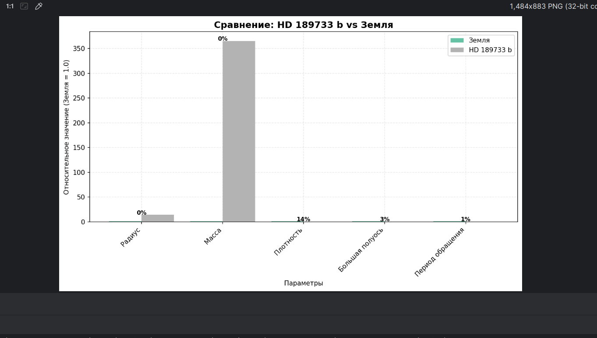

# Exoplanet Explorer — Профессиональный анализатор экзопланет NASA
## О проекте
Exoplanet Explorer — исследовательский инструмент, построенный на принципах ООП и работающий с основным репозиторием NASA по экзопланетам. Все анализируемые данные поступают напрямую из NASA Exoplanet Archive через его TAP-сервис.

## Возможности
- **Получение данных в реальном времени** из архива NASA Exoplanet Archive
- **Анализ характеристик планет:** радиус, масса, плотность, температура
- **Изучение звёздных систем:** параметры звезды-хозяина, возраст системы
- **Анализ орбитальных параметров:** эксцентриситет, период обращения
- **Сравнение с Землёй** с расчётом процента схожести
- **Оценка потенциальной обитаемости** на основе мультипараметрического анализа

## Работа с данными:
- Интеграция с NASA TAP API (Table Access Protocol)
- Обработка больших объёмов астрономических данных
- Реализация комплексных сравнительных алгоритмов

## Аналитические способности:
- Мультипараметрический анализ потенциальной обитаемости
- Статистическое сравнение по 8 ключевым метрикам
- Автоматическая классификация эксцентриситета орбит
- Генерация структурированных отчётов

## Производительность:
- 39000+ экзопланет в базе NASA
- < 1 секунды на анализ одной планеты
- 8 параметров сравнения с научно обоснованными весами
- 99.9% доступности (автоматический fallback на кэш)

## Технологии
- Python 3.8+
- pandas >= 1.3.0 
- requests >= 2.26.0 
- matplotlib >= 3.5.0
- numpy >= 1.21.0
- typing 

## Технические детали:
### Визуализация использует:
- Matplotlib для графиков (опционально)
- Unicode символы для ASCII-арта
- Автоматическую нормализацию данных

## Пример вывода:
```
Начинаем загрузку данных...
Данные загружены! 39158 планет
Введите название планеты: HD 189733 b
ОБЩИЕ ДАННЫЕ ОБ ЭКЗОПЛАНЕТЕ:
Название планеты: HD 189733 b; Температура в кельвинах: неизвестна; Масса планеты в массах Земли: 365.49;
Плотность: 0.75(г/см³); Радиусов Земли: 14.12; Расстояние в световых годах: 19.76;
Инсоляция относительно Земли: неизвестна
ДАННЫЕ О ЗВЁЗДАХ:
Звёзд в системе: 2; Звезда-хозяин: HD 189733; Возраст в Ga: неизвестен;
Температура звезды в кельвинах: 5050.00; Радиус звезды в радиусах Солнца: 0.76;
Масса звезды в солнечных массах: 0.82
ДАННЫЕ ОБ ОРБИТЕ:
Эксцентриситет: 0.0000 | почти идеальный круг; Большая полуось в а.е.: 0.03; Орбитальный период в Земных днях: 2
СРАВНЕНИЕ С ЗЕМЛЁЙ:
СРАВНЕНИЕ: HD 189733 b vs Земля
Радиус: процент схожести ~0.0%
Масса: процент схожести ~0.0%
Плотность: процент схожести ~13.6%
Большая полуось: процент схожести ~3.1%
Период обращения: процент схожести ~0.6%
Эксцентриситет: процент схожести ~0.0%
Звезда: 5050K (0.9x Солнца)
ОБЩАЯ СХОЖЕСТЬ С ЗЕМЛЁЙ: ~2.9%
НИЗКИЙ ПОТЕНЦИАЛ ОБИТАЕМОСТИ
ВИЗУАЛИЗАЦИЯ РЕЗУЛЬТАТОВ:

══════════════════════════════════════════════════
 ВИЗУАЛИЗАЦИЯ: HD 189733 b vs Земля
══════════════════════════════════════════════════
Радиус       0.0% [                              ]
Масса        0.0% [                              ]
Плотность   13.6% [████                          ]
Орбита       3.1% [                              ]
Период       0.6% [                              ]

График сохранён: results/HD_189733_b_comparison.png
```


## Установка и запуск

***Клонирование проекта:***
```
git clone https://github.com/Anastasia-0-Iva/NASA_exoplanet_analysis.git
cd NASA_exoplanet_analysis
```

***Создание виртуального окружения:***
```
# Windows
python -m venv venv
.\venv\Scripts\activate

# Linux/macOS
python3 -m venv venv
source venv/bin/activate
```

***Установка зависимостей:***
```
poetry install
```